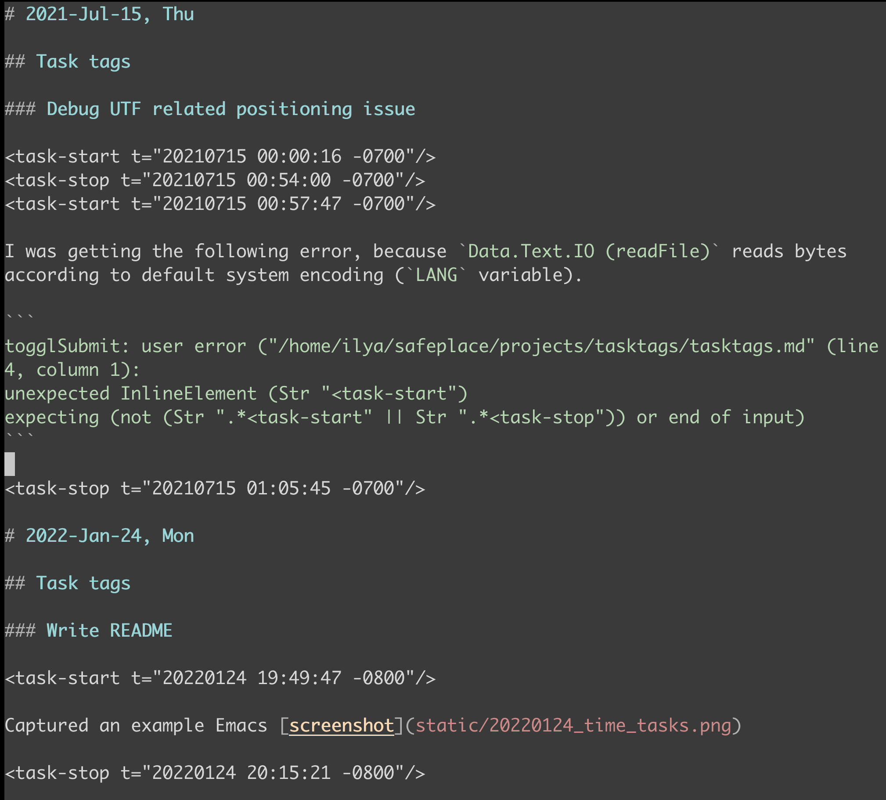
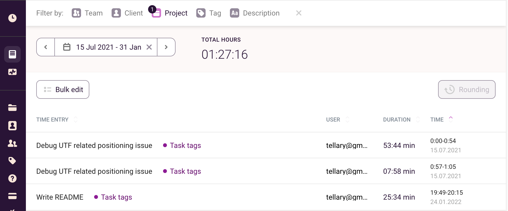
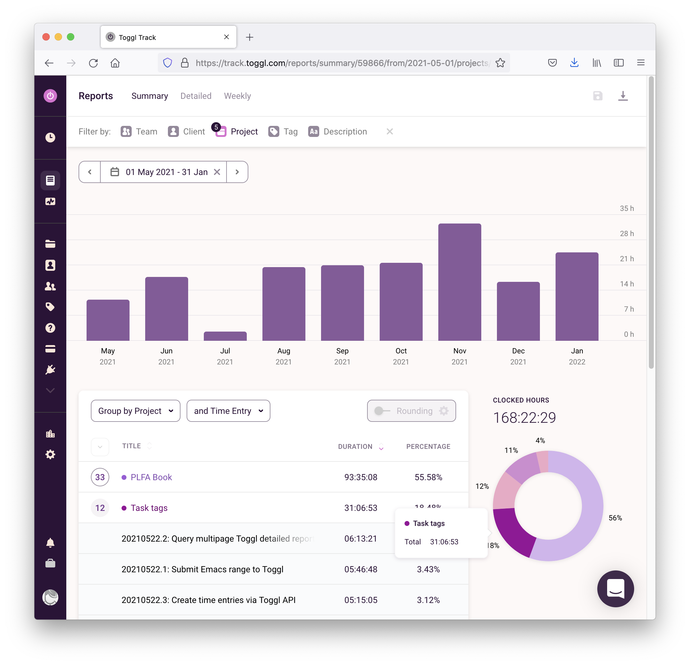
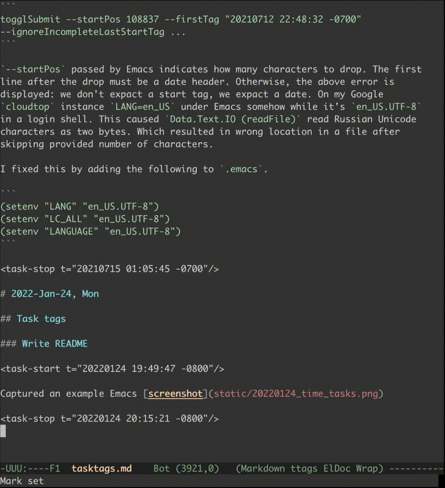

Task tags: A text-based time tracker
====================================

Task tags allow you to track time right in your [Markdown](https://daringfireball.net/projects/markdown/) "work log" and view time reports in [Toggl](https://track.toggl.com/) time tracking application.

If your workflow includes taking notes on tasks you do in a text editor and you want to track exactly how much time you spend on which task, then this project may be helpful for you. Just hit a shortcut in your favorite text editor to start and stop clocking time on a task (only Emacs is supported now).

Here is an example work log with time entries for this very project:

You can see that `<task-start/>` and `<task-stop/>` tags denote time entries. These task tags are nothing more than part of your notes on tasks. Level three headings denote tasks, level two---projects, and dates are level one headings.

These exact time entries from the screenshot look like the following when imported to Toggl. 

And an example report that includes work on the "Task tags" project may look as follows:

To submit time entries to Toggl, you position the cursor in a work log Markdown file and run the `task-toggl-submit` command to submit all time entries starting from the cursor position until the end of the file. Alternatively, you can select a text region and run the `task-toggl-submit` command. Here is how it looks:

